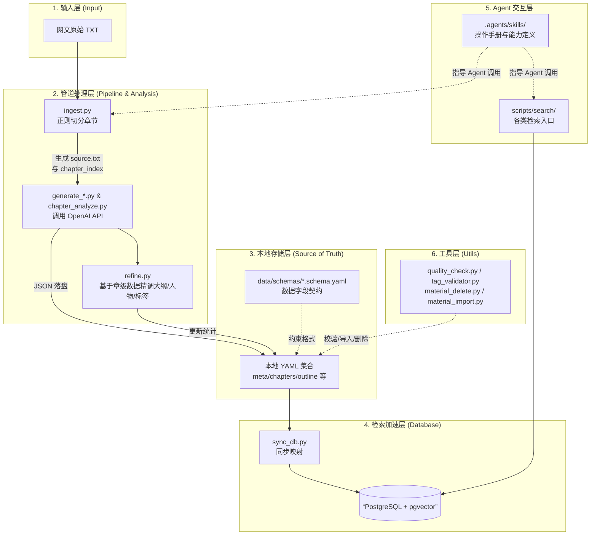

# 系统架构设计 (ARCHITECTURE.md)

本文档描述 Novel Material V2 的真实系统架构、数据流向以及各个模块的边界。

## 1. 核心定位与原则

*   **双库驱动（YAML 为真值库）**：所有非结构化文本通过 LLM 抽取后，必须先固化为本地 `.yaml` 文件。PostgreSQL 仅作为“随抛随建”的加速检索层。
*   **不作细粒度拆分**：项目坚决抵制拆分“事件”或“场景”。**章节 (Chapter)** 是系统进行大模型语义处理的最小单元。
*   **AI Agent 首要支持**：抛弃繁琐的 Web UI，本项目所有的数据获取和修改均由具备 LLM 能力的 Agent 通过 CLI 脚本调用完成。

## 2. 系统全景架构

## 3. 数据状态流转 (State Machine)

一本小说在系统中的生命周期由 `meta.yaml` 中的 `status` 字段严格控制：

1.  **`raw`**：初始状态，尚未处理。
2.  **`clean`**：经过 `ingest.py` 格式清洗和章节切分，拥有了 `chapter_index.yaml`。
3.  **`analyzed`**：经过 LLM 抽取，大纲、世界观、章级摘要等均已生成（YAML 落盘完毕）。
4.  **`indexed`**：向量数据生成完毕（`embed_chapters.py` 写入 `chapter_embeddings.yaml`），且全部映射写入 PostgreSQL。

## 4. 技术栈映射关系

| 组件 | 选型 | 备注 |
| :--- | :--- | :--- |
| **基础语言** | Python 3.10+ | 负责流水线调度和所有数据处理 |
| **LLM 抽取** | OpenAI 兼容接口 | 当前配置预期使用 `gpt-4o-mini` |
| **关系型查询** | PostgreSQL | 支持 `chapters`, `characters`, `tags`(JSONB) 的高效过滤 |
| **语义检索** | `pgvector` | （规划中）基于 1024 维 `BGE-large-zh` 进行相似度匹配 |

## 5. Agent 协作机制 (`.agents/` 目录)

本项目的特殊之处在于其自带的 `.agents/skills` 目录。
这些 Markdown 文件本身不被任何 Python 代码 `import`，而是作为**提示词（Prompt）和说明书**供外部 AI Agent 阅读的。
当您让 Agent “检索一段大纲”时，Agent 会：
1. 查阅 `.agents/skills/search/SKILL.md`。
2. 获知应当执行 `python scripts/search/search_outline.py "..."`。
3. 解析终端返回的 JSON 结果并回答您。

## 6. 工具层 (`scripts/utils/`)

项目包含一组被流水线或独立调用的工具脚本：

| 脚本 | 用途 | 调用时机 |
| :--- | :--- | :--- |
| `refine.py` | 基于章级数据精调大纲/人物/标签 | 被 `pipeline.py finalize` 直接调用 |
| `quality_check.py` | 校验章级分析的摘要长度、标签合法性等 | 独立调用 |
| `tag_validator.py` | 校验标签是否来自 `data/tags.yaml` 字典 | 独立调用 |
| `material_delete.py` | 删除素材及清理关联数据 | 独立调用 |
| `material_import.py` | 导入外部已分析好的素材 | 独立调用 |

## 7. 数据契约层 (`data/schemas/` 与 `data/tag-system/`)

*   **`data/schemas/`**：包含 11 份 YAML Schema 定义文件（如 `meta.schema.yaml`、`outline.schema.yaml`、`characters.schema.yaml` 等），是所有 YAML 数据文件的字段格式契约。任何新增或修改 YAML 字段均应先更新对应的 Schema。
*   **`data/tag-system/`**：包含从频道层到章节功能层的完整 10 篇标签分类学规格，是 `data/tags.yaml` 的设计来源，也是 LLM 在执行标签标注时应当被注入 Prompt 的分类学依据。

## 8. 已知的遗留问题与待决策项

阶段一至六的修复工作已完成，以下是当前尚存的未解决问题：

*   **标签体系未激活**：`data/tag-system/` 包含 10 篇完整分类学文档（600+ 标签值），但没有任何脚本将其注入 LLM Prompt。`chapter_analyze.py` 让 LLM 选章节功能标签时，未提供合法值列表，导致 LLM 自由发挥后频繁触发校验报错。（详见 DEFECTS_AND_ROADMAP.md T1）
*   **配置体系割裂**：`config/database.yaml` 无人读取；`requirements.txt` 中有 `sqlalchemy` 但实际代码全部使用裸 `psycopg2`。（待决策）
*   **`material/` 目录归属不明**：根目录有一个未纳管的网文原文目录，不在 `.gitignore` 中，不被任何脚本引用。（待决策）
*   **集成验证尚未执行**：所有修复均为代码层面，全链路端到端验证（含真实 LLM 调用和数据库写入）尚未进行。

> **完整问题清单与下一步行动**：请查阅 [DEFECTS_AND_ROADMAP.md](docs/DEFECTS_AND_ROADMAP.md)。
